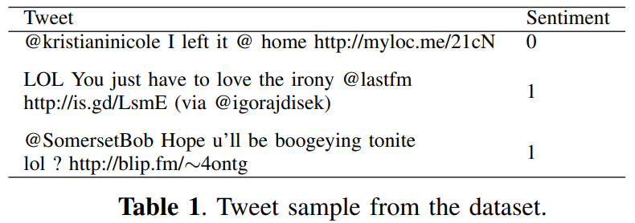
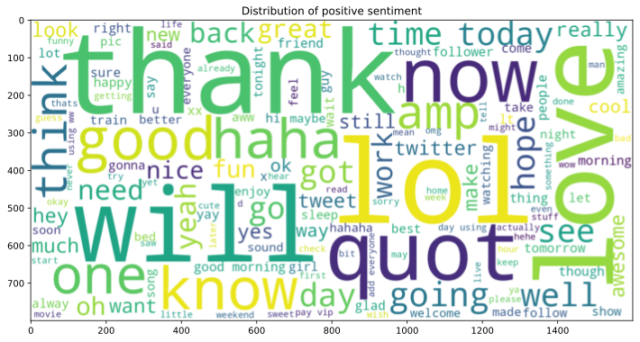
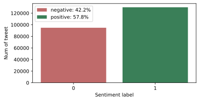
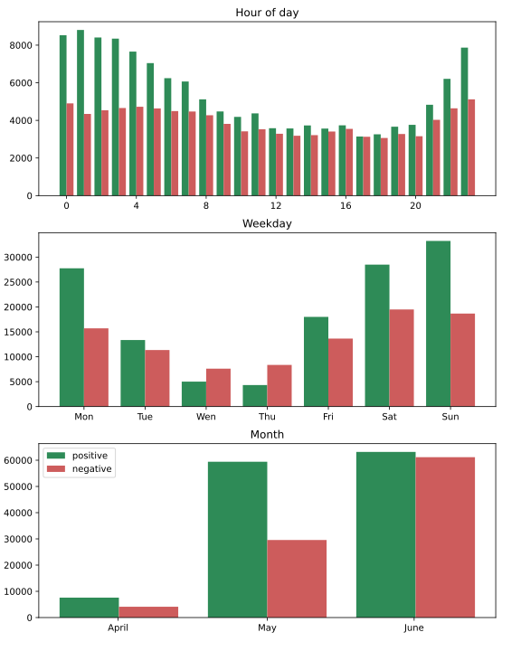
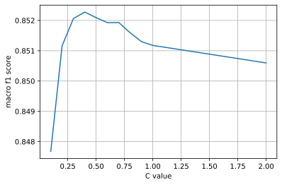
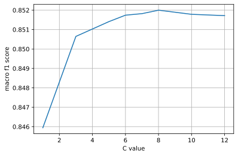

# Twitter Sentiment Analisys
This project is the final project for the exam `Data Science Lab: process and methods (2021/22)`. The overall score achieved in the final competition was 0.853, which outperformed the given baseline 0.750.

## Abstract
In this report we introduce a possible approach to predict the sentiment associated with a tweet, based on the content of its text. The proposed solution infers the tweets’ sentiment by means of a classification model, that gives overall satisfactory results. In this paper the classification technique used
are logistic regression and linearSVC.

## Problem overview
The proposed project is a classification problem on a dataset of tweets. For each tweet the following information is provided:
- *Id*: a numerical identifier of the tweet.
- *date*: the date in which the tweet was published.
- *flag*: the query used to collect the tweet.
- *user*: username of the person who posted the tweet.
- *text*: the text of the tweet.
- *sentiment*: indicator of whether it’s positive (1) or negative (0).
A few samples of tweets text from the dataset and relative sentiment are shown in Table 1. As we can see the quality of writing is quite low.
Moreover, the wordclouds shown in Figures 1 and 2 give us a visual representation of the word distribution of positive and negative sentiment tweets.

 
  
 
 

The data-set is divided into two parts:
- a *development set*, containing 224994 entries for which, in addition to the previously mentioned features, the sentiment of the tweet is also known.
- an *evaluation set*, comprised of 74999 entries. We will use the development set to build a classification model to predict the sentiment of these tweets.
Let us now focus our attention on the development set.
In Figure 3, the distribution of the sentiment feature is shown and we can observe that there are more positive tweets
overall implying that the dataset is unbalanced.
One more thing that is worth mentioning is the distribution of the sentiment over the date attribute. All the tweets in the dataset are posted in a period between April and June 2009. Initially, we assumed that the date did not provide valuable information in predicting the sentiment of tweets, but as shown in figure 4, it plays an important role. For instance, people tend to leave more positive comments during specific hours in a day. Also, different days of week and month give us different portions of negative and positive tweets which can be explained by the general mood of society or important events. Further analyzing the development dataset, it can be seen that there are roughly 270 tweet duplicate ids. We can also note that all of the tweets come from 10,647 unique users and that approximately 1888 tweets have the same text, implying that they could be retweets. Acknowledging that all of the tweets come from a relatively small number of people is important, because it allows our model to identify users who are more likely to post a positive or negative tweet.

 
  
 

## Proposed approach
#### Preprocessing
The first step is to remove the columns flag and ids, which provide no valuable information for our purpose. It might also be worth mentioning that our dataset does not have any missing values.
The preprocessing pipeline could be divided in two main parts:
1. `Text cleaning`: Since text column is textual, to process this feature, we will make use of TfidfVectorizer, provided by Scikit-learn’s library. Note that in the term frequency–inverse document, the frequency of a term is a numerical value computed separately for each document (in our case tweet text) of the data-set. It is directly proportional to the number of occurrences of the term in the document, and inversely proportional to the number of documents in which the term is present.
But as we can see from Table 1, many tweets have some grammatical and syntax issues. We need to reduce the feature size resulted from tfidf. An effective preprocessing method can reduce the size of the featured set extracted from the dataset. The main steps of the pipeline to clean the tweets are:
- Un-capitalizing the tweet text
- Cutting out mentions (’@’) before user
- Cutting out links
- Replacing three or more same consecutive letters with only two letters
- Replacing special characters and special short words or slangs
- Removing all punctuation and non-ASCII characters.
In contrast stop words are not removed since it had a negative effect on accuracy. Some words that are considered stop words, i.e., not, i and you, have a relevant feature importance for tfidfVectorizer. Their removal could completely change the meaning of the sentence.
2. `Date and user encoding`: Some categorical features are provided in the dataset. First, Date is split in hour, weekday, day, month and year. Since year has the same value for all tweets, it will be discarded. Then these new features are processed by applying one hot encoding along with user.

#### Model selection
The following Scikit-learn’s classifiers have been tested:
1. `Logistic Regression`: it is a statistical-based classifier that is mostly used for the analysis of binary data in which one or more variables are
used to find the results. It is also used for the evaluation of the probability of class association. Logistic Regression gives better results when the target class is categorical.
It produces the affiliation among the categorical dependent variable and one or more independent variables by approximating probabilities using a Logistic Regression sigmoid function. The following parameter will be tuned:
- C: Inverse of regularization strength; must be a positive float
- tol: Tolerance for stopping criteria.
2. `LinearSVC`
it is based on Support Vector Machine with a linear kernel and is specifically intended for binary classification problems.
The following parameter will be tuned:
- C: Regularization parameter which is inversely proportional to the strength of the regularization. Must be positive;
- tol: Tolerance for stopping criteria.
For both classifiers, the best-working configuration of hyperparameters has been identified through a grid search, as explained in the following section.
Other classifiers like Random Forest and MultinomialNB were tested, but they were not able to build a model with speed and accuracy comparable to those provided by the LinearSVC and LR classifiers. In fact the number of entries and features was too large for the machine used to build the model and this
resulted in a lengthy computation.

#### Hyperparameters tuning
Hyperparameter tuning is a vital step in finding the best configuration of the parameters of our classifier. To train and evaluate the model, the available development set is split into a train set and a test set. The train set is 80% of the development set size, the test set is the remaining 20%. The performance of the model will be determined by calculating the F-measure f1_macro on the sentiment feature. The first main hyperparameter that needs to be tuned to improve the accuracy of the model is ngram range in the TfidfVectorizer. By changing the ngram range parameters, we can decide whether to consider or not single words and longer expressions. To perform this hyperparameters tuning, we initially set a classifier to default parameter and select the optimal ngram range parameters for the TfidfVectorizer. Next, we tune the parameter for both LinearSVC and LogisticRegression. The different values tested are shown in the following table.

| **Model**  | **Hyperparameters** | **Values**  | 
| ------------- | ------------- | ------------- | 
| LinearSVC | C   tol |  [0.1, 0.2, 0.3, 0.4, 0.5, 0.6, 0.8, 1, 2]   [0.01, 0.001, 0.0001, 0.00001] | 
| Logistic Regression |  C   tol | [1.0, 3.0, 5.0, 6.0, 7.0, 8.0, 10.0, 12.0]   [0.001, 0.0001] |

All of the aforementioned hyperparameter searches were done using a 5-fold Cross Validation Grid Search that returns the optimal hyperparameter configuration for each model, which is then compared to unseen data from the test set.

## Results
From the Hyperparameter tuning, the ngram for tfidfVectorizer selected is (1, 3), which means that the model prefers a contiguous sequence of 1 to 3 words. Due to computational limit, only a limited number of parameters were tested in Grid Search. So a more detailed C value tuning is performed to
find the best one for both classifiers. The further fine tuning is summarized in Figure 5 and in Figure 6.

 
 

At the end in table 3, the best hyperparameters for both classifiers are summarized. We can notice that LinearSVC performed slightly better in local than Logistic Regression, so we use LinearSVC for final evaluation. 

| **Model**  | **Hyperparameters** | **Values**  | **LocalF1**  | **PublicF1**  | 
| ------------- | ------------- | ------------- | ------------- | ------------- | 
| LinearSVC | C   tol |  0.4   0.01 | 0.852 | 0.853 |
| Logistic Regression |  C   tol |  8   0.001 | 0.852 | 0.852 |

Finally using 80% of the development set as our train set and the remaining as the test set, our pipeline can build a model which achieves a 0.852 f1macro score in private using LinearSVC. We can now predict the sentiment values of the evaluation set. After submitting our predicted sentiment values, we achieved the same result on public leaderboard, which significantly outperforms the given baseline score of 0.753.
For comparison, a simpler approach with minimal preprocessing and hyperparameter tuning can be described as follows:
1. The date column is split in hour, weekday, day, month. Then with user column are encoded using the One Hot Encoding Technique.
2. Remove link and @ before user and punctuation from the tweet text.
3. The LinearSVC is used to build the prediction model, with default hyperparameters.
The f1 score achieved by this simple model prediction is 0.830, which is still better than the baseline score but significantly lower than the f1 score obtained by our pipeline.

## Discussion
The obtained score of 0.852 is considerably higher than the proposed 0.753 baseline. A few approaches that were considered but did not significantly improve the score are listed here:
- After computing the tweet text length of each entry, a correlation index of -0.036 was found between the text length and the sentiment. A model that included this attribute was tested and achieved a public score of 0.852, so no changes on the result. Another feature considered was counting the capital letters in each tweet. Also in this case there is a low correlation of 0.025 and the score at the end does not change.
- A lemmatization and tokenization approach was tested. The nltk library provided some methods to reduce the variance of a word to a common root word. The accuracy achieved decreased to 0.827 on public score. 
-  Since the dataset is unbalanced, 40000 negative tweets are sampled from development set and attached to it in order to leveling the sentiment feature. The copied tweet caused a huge overfitting in local and the public score get only 0.820.

Since there seems to be little room for improvement, some future improvements should be considered:
- the dataset could be balanced in a smarter way, using other techniques such as SMOTE.
- the preprocessing step could be improved by using a list of stop words specifically designed. The top ten most correlated words for each sentiment are provided in Tables 4 and 5, which could be useful for the selection of custom stopwords. Also a custom lemmatizer and tokenizer should be considered.
- Since both LinearSVC and LogisticRegression achieved similar results, it would be useful to find a third good technique to ensemble a voting classifier.

## Code and paper
The complete report is available [here](https://github.com/MatteoM95/Twitter-Sentiment-Analisys/blob/master/Twitter_Sentiment_Analysis_Report.pdf). 

The code is available [here](https://github.com/MatteoM95/Twitter-Sentiment-Analisys/blob/master/Twitter_Sentiment_Analisys.ipynb)

### Contributors

